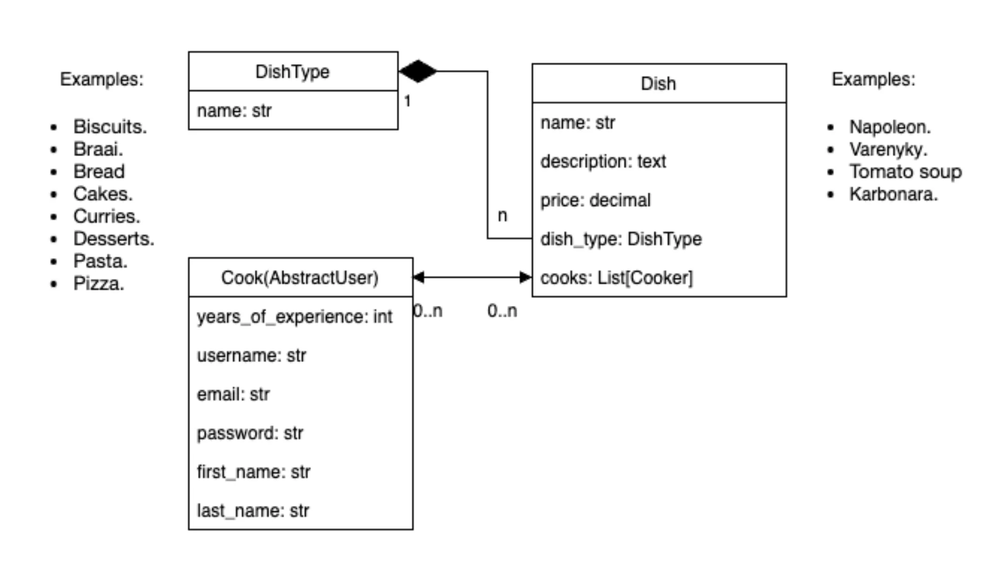
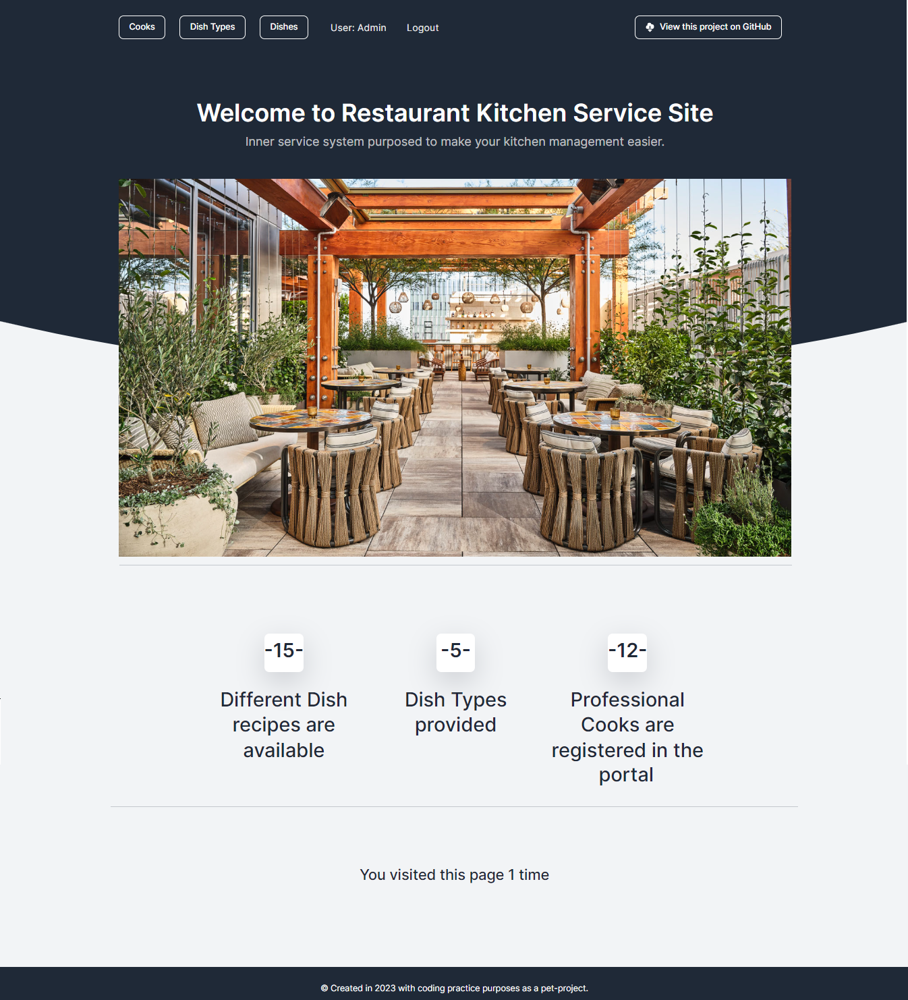
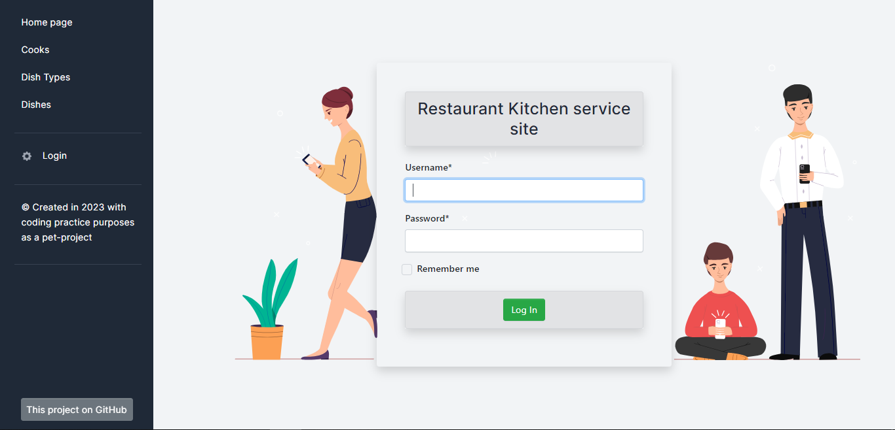
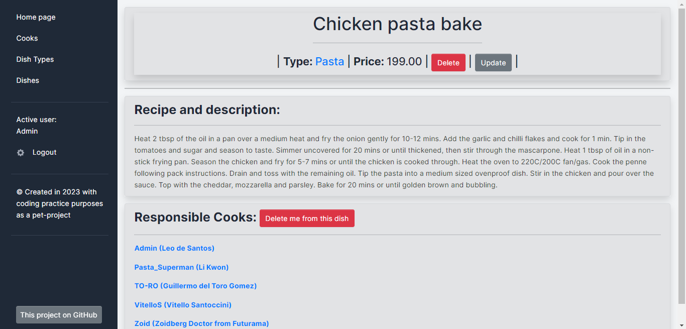
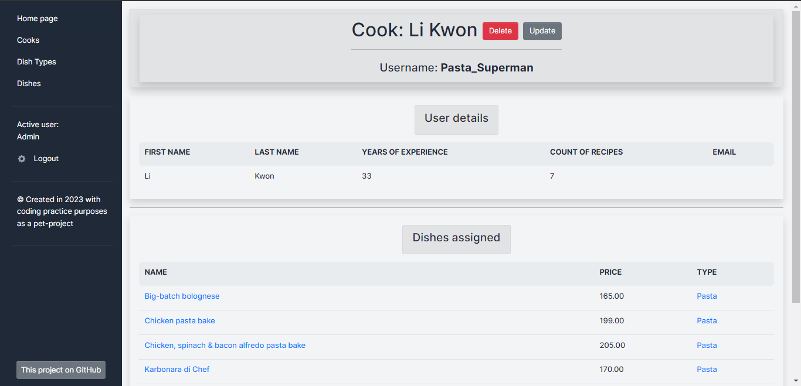
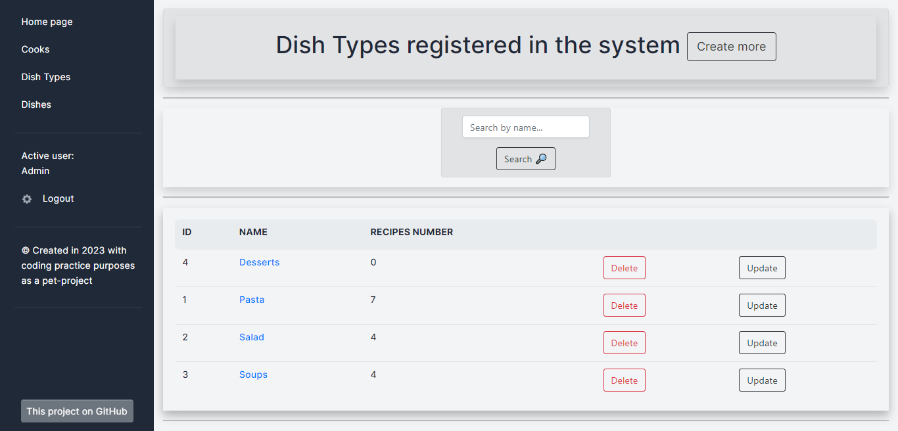
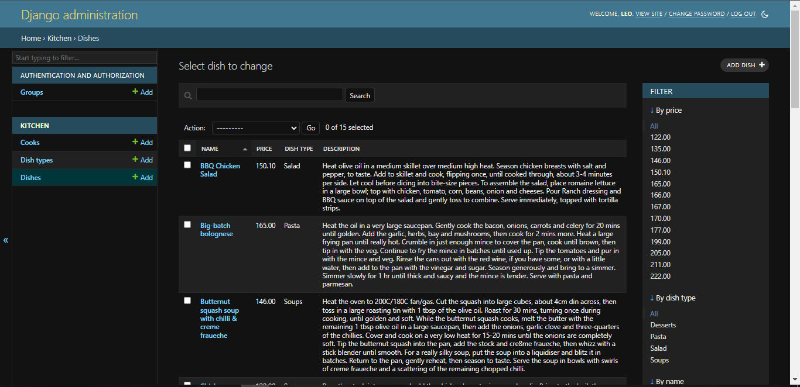
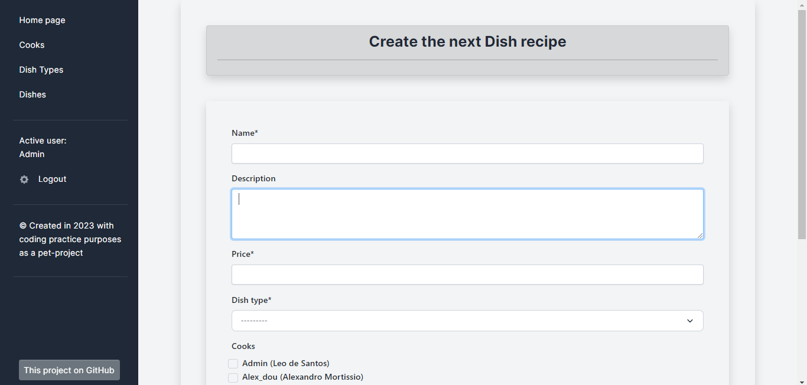
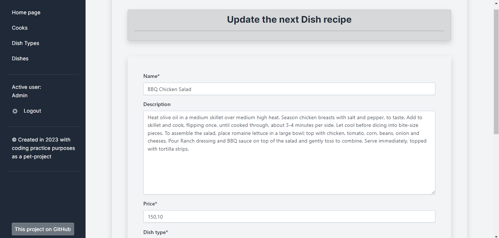
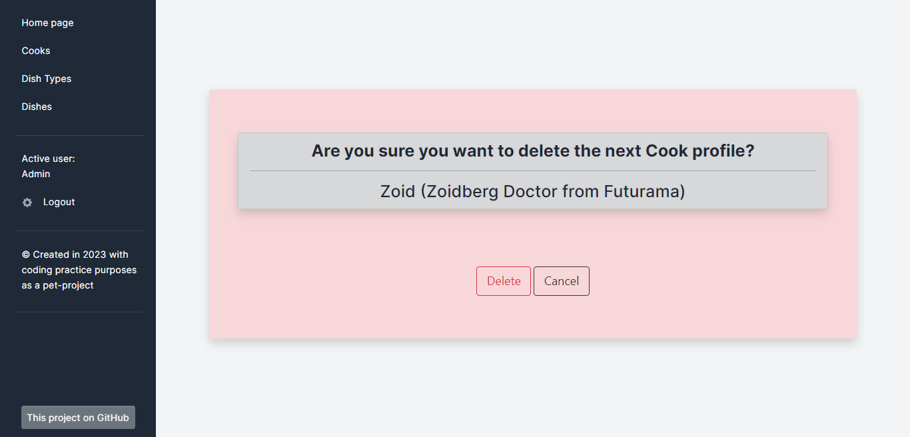

# ✨ Restaurant Kitchen Service site ✨

The kitchen of every restaurant needs a responsible division of duties and subordination. 
This Django project is designed to facilitate internal managing processes and provide web interface where you can easily add, change or delete any data.
Each Cook of your restaurant has own profile with corresponding information and Dishes he/she is assigned to prepare. 
---

## 🌐 Visit my project deployed to Render: 🌐 
### [Restaurant Kitchen Service site](https://restaurant-kitchen-site.onrender.com)

Be aware that website is working very slowly only due to free server usage in deployment👆. (Page can load 10 seconds)
Thank you for understanding!

---
### 🗝 Welcome to log in and test the website, use the next test-user data for full access: 🗝
```python
username: Test-With-Love
password: Welcome-There_1
```

## 💾 Installation using GIT: 💾 

NOTE PLEASE: Python3 must be already installed. 

```python
git clone https://github.com/bohdan-yatsyna/kitchen-service-site.git
cd kitchen-service-site
python3 -m venv venv

venv\Scripts\activate (on Windows)
source venv/bin/activate (on macOS)

pip install -r requirement.txt
python manage.py migrate
python manage.py runserver
```

Open preferable web-browser and enter the next link "http://127.0.0.1:8000/"

---
## 🚀  Features 🚀 
- Customizable Django admin pannel (for superusers)
- Reliable Django Authentication functions and Validations
- Intuitive managing system for Restaurant Kitchen with website interface
- Ability for easily access to your recipes and cooks profiles with opportunity of add, change or delete any data.
- Possibility to assign a responsible cook for preparing a dish or dishes.
- Made with love ;-)

---
## 💾 DB Structure: 💾 


---
## ✨ PREVIEWS OF WEBPAGES ARE BELOW: ✨

### Home page:


### Login page:


### Detail views and List pages (Cook, Dish, DishType):







### Admin panel for superusers:


### And more:





